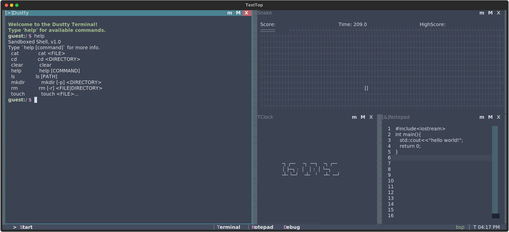
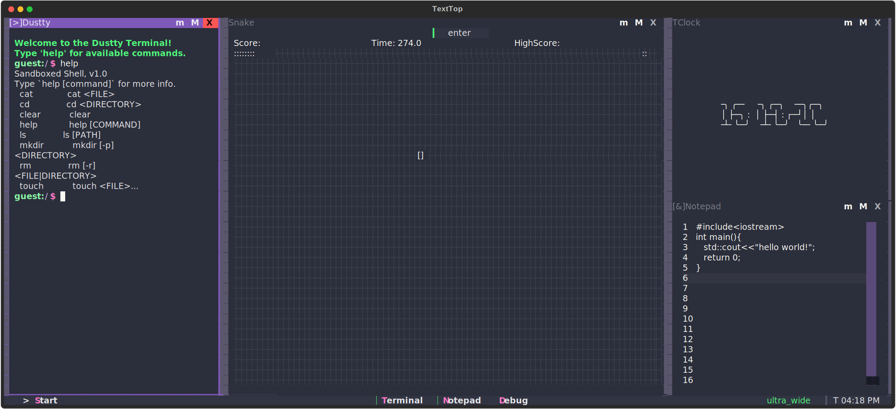

# TextTop v0.5

[](LICENSE)
[]()
[]()
[]()

> A **desktop environment simulator inside your terminal**, built with [Textual](https://github.com/Textualize/textual).  
> Simulates a full GUI experience — windows, taskbar, start menu, and apps inside a terminal.
> Also supports pty and multiplex via the patty terminal (Linux only).

---

## Table of Contents
- [Overview](#-overview)
- [Features](#-features)
- [Screenshots](#-screenshots)
- [Installation](#-installation)
- [Usage](#-usage)
- [Applications](#-applications)
- [Architecture](#-architecture)
- [Roadmap](#-roadmap)
- [License](#-license)

---

## Overview

**TextTop** is a text-based desktop environment (?) built for the terminal.
It provides a simulated OS experience — a window manager, start menu, apps, and dynamic layouts.

### Highlights
- Windowed GUI in the terminal
- Windows OS / Linux WM Layout Styles
- Mouse & keyboard navigation
- Virtual File System (VFS) for sandbox access
- Extensible modular architecture

---

## Features

### Basic Window Manager
- **Floating Mode** - move windows freely on the terminal.
- **Tiling Mode** - automatically snap windows to layouts (supports: `vstack`, `hstack`, `bsp`, `bsp_alt`, `ultra_wide`, `ultra_tall`)
- **Windows** - adds border, title bar, and controls to programs
- **Window controls** - **move**, **resize**, **minimize**, **maximize**, **close**
- **Focus handling** - Cycle focus, swap windows (tiled)
- **Flyouts** - popup menus, context menus

### Basic Desktop Components
- **Taskbar** - widgets (clock, app launchers, start menu, window manager layout display)
- **Start Menu** - lists supported programs in the `/bin` directory
- **Notifications**

### Themes
- **textual-dark**
- **textual-light**
- **nord**
- **gruvbox**
- **catpuccin-mocha**
- **dracula**
- **tokyo-night**
- **monokai**
- **flexoki**
- **catpuccin-latte**
- **solarized-light**

### Compatibility
- Most programs built with textual
- Most programs that run on the terminal (Linux)

### Included Applications
- **Clock** - digital clock widget
- **Notepad** - minimalist text editor
- **Snake** - classic terminal snake game
- **Patty** - xterm-based terminal emulator (Linux only)
- **Dustty** - command dispatcher

---

## Screenshots

<p align="center">
  
  
</p>

<p align="center">
  
</p>

---

## Installation

### Prerequisites
- Python **3.11+**
- [Textual v6.5.0](https://github.com/Textualize/textual)
- Unix-like terminal (Linux, macOS, or WSL)
- or Windows cli (cmd/powershell; not fully supported yet)

### Clone & Install
**Clone the repository**
```bash
git clone https://github.com/l4xp/textop.git
cd textop
```
**Use a virtual environment** *(optional, but recommended)*
```bash
pip -m venv .venv
.venv/Scripts/activate # use the script compatible with your terminal
```
**Install dependencies** 
```bash
pip install -r requirements.txt
```

---

## Usage

To run the program:

```bash
python boot.py
```

or

```bash
textual run boot.py
```

### Keyboard Shortcuts (to be updated)
* `ctrl+p` → `keys` to list all keys in the current context

| Key                      | Action                    |
| ------------------------ | ------------------------- |
| `Alt + Tab`              | Switch active window      |
| `Ctrl + ↑/↓/←/→`         | Move window directionally |
| `Ctrl + p`               | Toggle Command Palette    |


---

## Roadmap
---

| **Category**                     | **Feature**                                                                                      | **Status**  |
|-----------------------------------|--------------------------------------------------------------------------------------------------|-------------|
| **General System & Display**      | Windows z-levels (layers)                                                                        | `[~]`         |
|                                   | Popup/expandable mini windows (flyouts system)                                                   | `[x]`         |
|                                   | Desktop icons for applications (glyphs system)                                                  | `[~]`         |
|                                   | Installer/setup mode for initial configuration                                                  | `[ ]`         |
|                                   | Animations? (heavy)                                                                              | `[ ]`         |
|                                   | Simulated filesystem and OS folder structure (bin, home, etc.) (vfs)                            | `[~]`         |
| **Window Management**             | Workspaces / multiple desktops                                                                   | `[ ]`         |
|                                   | Window Basics (open, minimize, maximize, close, move, resize)                                    | `[x]`         |
|                                   | App switcher (Alt+Tab / activewindowlist)                                                        | `[x]`         |
|                                   | Window states (runtime)                                                                          | `[x]`         |
|                                   | Window states (memory)                                                                           | `[ ]`         |
|                                   | Dynamic Layouts (float, vstack, hstack, uwide, utall, bsp, bsp_alt)                             | `[x]`         |
| **Desktop**                       | Notification/toast system                                                                         | `[x]`         |
|                                   | State persistence (snapshots)                                                                   | `[ ]`         |
|                                   | User system (login/logout/switch/create/delete)                                                  | `[ ]`         |
|                                   | Security (privileges, passwords, encrypt, decrypt system, hide/show)                            | `[ ]`         |
|                                   | Global 'cursor', kb/mouse controlled                                                             | `[ ]`         |
| **Status Bar**                    | Launchers (terminal, notepad, debug)                                                            | `[x]`         |
|                                   | Dynamic launcher pinning                                                                         | `[ ]`         |
|                                   | Taskbar widgets (battery, volume, etc.)                                                         | `[x]`         |
|                                   | Active Window feedback + switcher                                                                | `[x]`         |
|                                   | Start menu populated from an application directory                                              | `[x]`         |
|                                   | Start Menu                                                                                      | `[~]`         |
|                                   | Search functionality                                                                             | `[ ]`         |
| **Apps**                          | Notepad, terminal/s, snake game                                                                  | `[x]`         |
|                                   | Calculator, browser, media viewer/player, file manager, settings                                 | `[ ]`         |
| **QOL**                           | Screenshot (copy a selection to clipboard)                                                      | `[ ]`         |
|                                   | Module-specific configs (taskbar, windows, wm)                                                  | `[ ]`         |
|                                   | CSS override configs (taskbar, windows, wm, desktop)                                            | `[ ]`         |
| **Compatibility**                 | Command Pallette (in place of hotkeys)                                                           | `[ ]`         |
|                                   | Use Ctrl+[A-Z, @], Enter, Esc, Tab, Backspace, Arrow keys, Function keys, Printable ASCII characters, UTF-8 text input only | `[ ]`         |


---

## License

This project is licensed under the **`MIT` License** — see the [LICENSE](LICENSE) file for details.

---

## Acknowledgments

* Built with [Textual](https://github.com/Textualize/textual)
* Inspired by windows, komorebi, linux, sway, vtm, dvtm, desqview

---
